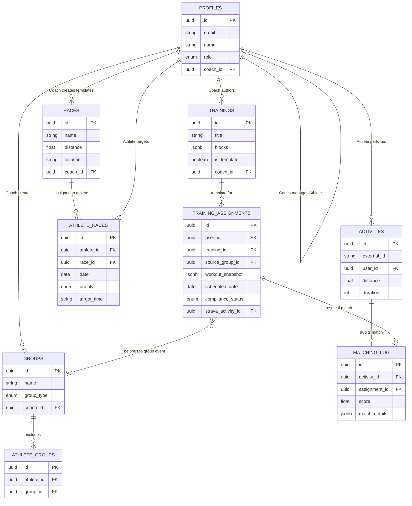

# Models & Relations

The platform's data models revolve around the core `PROFILES` table, which acts as the nexus for identities categorized as either Coaches or Athletes. 

Below is an Entity-Relationship diagram mapping how these domain models interact with one another.

## Entity Relationship Diagram

## Description of Key Flows

1. **Invitation Flow**: 
   A `COACH` (`PROFILES.role = 'COACH'`) creates an `INVITATIONS` record. An athlete uses the token to create their `PROFILES` matching user, establishing the `coach_id`.

2. **Workout Scheduling & Snapshots**: 
   A coach authors `TRAININGS` (templates). When assigned, the system copies the workout blocks into `TRAINING_ASSIGNMENTS.workout_snapshot` (JSONB), creating an immutable historical record.

3. **Race Management**: 
   Coaches build a library of `RACES`. These are mapped to specific athletes via `ATHLETE_RACES`, which stores custom goals like `target_time` and `priority` (A, B, or C).

4. **Strava Synchronization & Matching**: 
   Real-time webhooks populate `ACTIVITIES`. The Matching Engine calculates compliance by comparing `ACTIVITIES` with `TRAINING_ASSIGNMENTS`. Each match attempt is logged in `MATCHING_LOG` for debugging and transparency.
