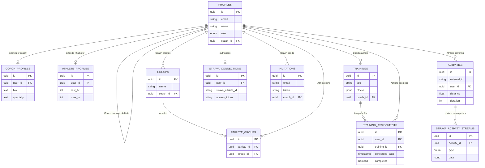

# Models & Relations

The platform's data models revolve around the core `PROFILES` table, which acts as the nexus for identities categorized as either Coaches or Athletes. 

Below is an Entity-Relationship diagram mapping how these domain models interact with one another.

## Entity Relationship Diagram

## Description of Key Flows

1. **Invitation Flow**: 
   A `COACH` (`PROFILES.role = 'COACH'`) creates an `INVITATIONS` record. An athlete uses the token to create their `PROFILES` matching user, effectively establishing the `coach_id` relationship.

2. **Group Assignment Flow**: 
   A coach organizes athletes by creating `GROUPS` and linking them via `ATHLETE_GROUPS`.

3. **Workout Scheduling Flow**: 
   A coach authors `TRAININGS` (templates), and then instantiates `TRAINING_ASSIGNMENTS` on specific dates for athletes. 

4. **Strava Synchronization Flow**: 
   An athlete authorizes the app, populating `STRAVA_CONNECTIONS`. Webhooks or background jobs pull completed workouts into `ACTIVITIES` and their detailed telemetry into `STRAVA_ACTIVITY_STREAMS`. The system then compares `ACTIVITIES` against `TRAINING_ASSIGNMENTS` to calculate compliance.
