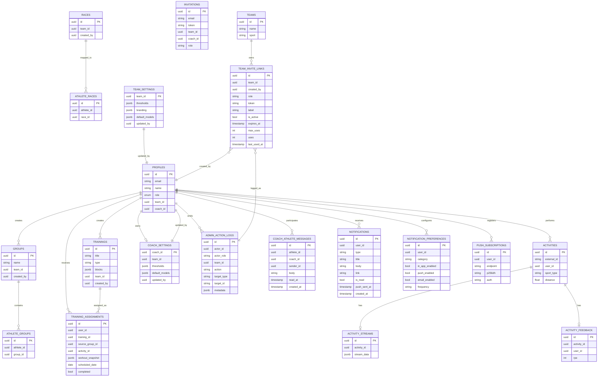

# Models and Relations

This document describes the current domain model used by the running platform.

## Core entity graph (conceptual)

> **Note:** `NOTIFICATIONS`, `NOTIFICATION_PREFERENCES`, and `PUSH_SUBSCRIPTIONS`
> are defined by migrations `20260628213203`, `20260628225621`, and `20260630003820`
> (the last adds `notifications.push_sent_at`). See
> [notifications.md](./notifications.md) and [database.md](./database.md).

## Key behavior notes

- Team scope is enforced through `team_id` and RLS/app checks.
- `coach_id` remains relevant for direct coach-athlete assignment paths.
- `created_by` tracks ownership metadata for trainings/groups/races.
- Assignment snapshots (`workout_snapshot`) preserve planned context at assignment time.
- Team/coaches can persist configurable thresholds/branding/default models.
- **`team_settings.max_athletes`** (integer, nullable) enforces athlete cap for pricing tiers; checked on per-email invites and team-link sign-ups.
- **`team_invite_links`** provides shareable sign-up URLs per team; atomic consumption via `consume_team_invite_link(token)` RPC; every use logs `team_invite_link.used` to `admin_action_logs`.
- Admin critical writes are captured in append-only `admin_action_logs`.
- **`coach_athlete_messages`** stores the two-way coach↔athlete chat; `sender_id`
  preserves the real author even on a shared thread. Chat messages produce a
  `chat_message` notification via `createNotification()`.
- **Notifications** fan out through a single producer (`createNotification`) to an
  in-app inbox and Web Push, gated by per-user, per-category `notification_preferences`.

## Activity IDs

- Use internal UUID for app routes and internal joins.
- Keep provider external ID for Strava API synchronization.

## Running-first current state

The schema supports multi-sport records (`sport_type`), but training target semantics and compliance logic are still tuned for running.
